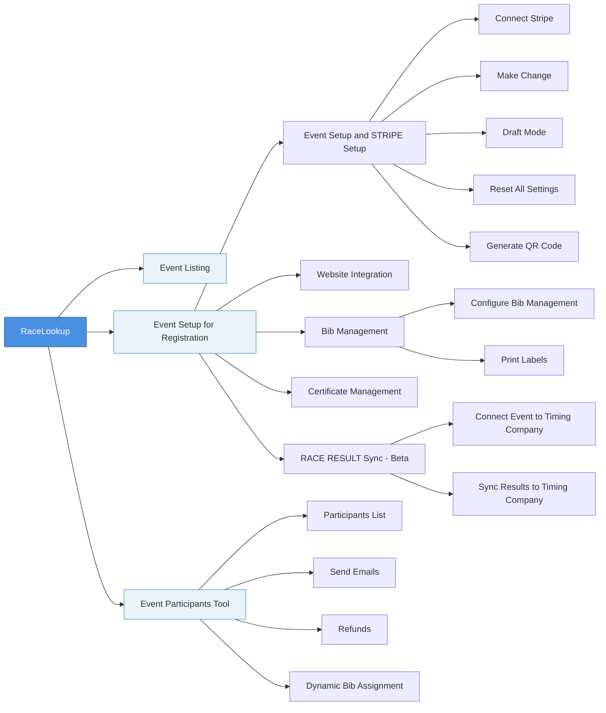

# Racelookup Event Managment Tool

## Documentation Pages

- **[Event Listing](/events/event-listing/)** - Manage and view all your events
- **[Event Setup for Registration](/events/event-setup-for-registration/)** - Configure event registration settings
  - **[Event Setup and STRIPE Setup](/events/event-setup-for-registration/event-setup-and-stripe-setup/)** - Payment processing configuration
    - **[Connect Stripe](/events/event-setup-for-registration/event-setup-and-stripe-setup/connect-stripe/)**
    - **[Make Change](/events/event-setup-for-registration/event-setup-and-stripe-setup/make-change/)**
    - **[Draft Mode](/events/event-setup-for-registration/event-setup-and-stripe-setup/draft-mode/)**
    - **[Reset All Settings](/events/event-setup-for-registration/event-setup-and-stripe-setup/reset-all-settings/)**
    - **[Generate QR Code](/events/event-setup-for-registration/event-setup-and-stripe-setup/generate-qr-code/)**
  - **[Website Integration](/events/event-setup-for-registration/website-integration/)** - Embed event registration on your website
  - **[Bib Management](/events/event-setup-for-registration/bib-management/)** - Configure and manage participant bib numbers
    - **[Configure Bib Management](/events/event-setup-for-registration/bib-management/configure-bib-management/)**
    - **[Print Labels](/events/event-setup-for-registration/bib-management/print-labels/)**
  - **[Certificate Management](/events/event-setup-for-registration/certificate-management/)** - Create and manage race certificates
  - **[RACE RESULT Sync - Beta](/events/event-setup-for-registration/race-result-sync/)** - Integrate with timing companies
    - **[Connect Event to Timing Company](/events/event-setup-for-registration/race-result-sync/connect-event-to-timing-company/)**
    - **[Sync Results to Timing Company](/events/event-setup-for-registration/race-result-sync/sync-results-to-timing-company/)**
- **[Event Participants Tool](/events/event-participants-tool/)** - Manage registered participants
  - **[Participants List](/events/event-participants-tool/participants-list/)**
  - **[Send Emails](/events/event-participants-tool/send-emails/)**
  - **[Refunds](/events/event-participants-tool/refunds/)**
  - **[Dynamic Bib Assignment](/events/event-participants-tool/dynamic-bib-assignment/)**

## Flow Chart

